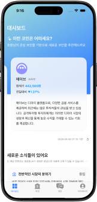
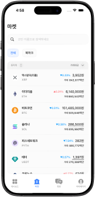
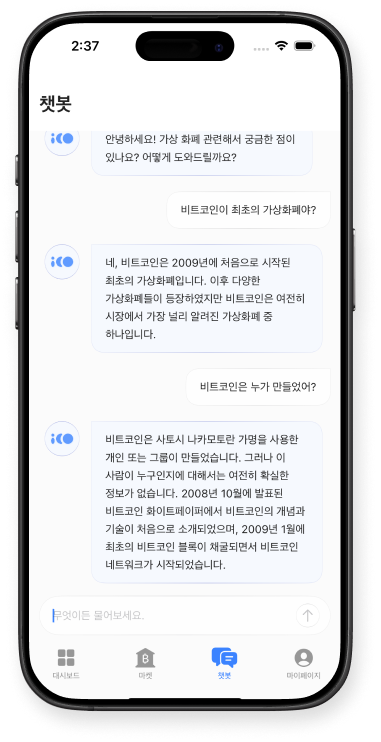
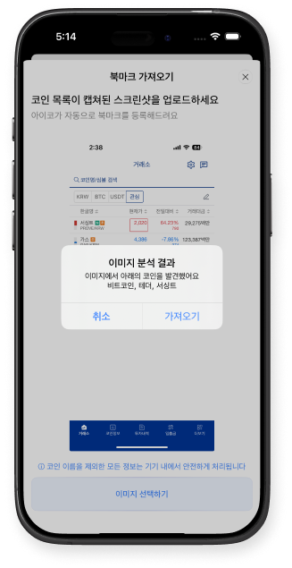
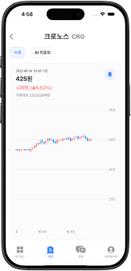
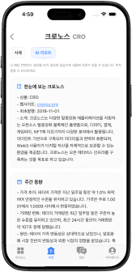
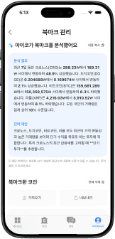
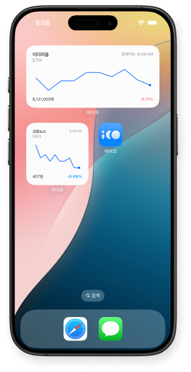

# iCo: AI Coin Curator

<p align="center"> 

</p> <p align="center"> <b>LLM 기반 코인 초보자를 위한 맞춤 큐레이션 서비스</b><br/> 아이폰과 아이패드 모두에서 최적화된 경험을 제공합니다. </p>

## ✨ Introduction

AICo는 **코인 입문자**를 위한 LLM 기반 큐레이션 서비스입니다.  
온보딩 단계에서 투자 성향을 분석하고, 실시간 시세/커뮤니티 데이터를 가공하여 **사용자 맞춤형 코인 정보**를 제공합니다.

단순한 시세 확인을 넘어,

- 📊 실시간 대시보드
- 🤖 챗봇 기반 Q&A
- 👁️ Vision을 활용한 이미지 인식/비식별화
- 📈 캔들 차트 및 AI 리포트
- 📋 북마크 및 위젯

등을 통해 **실용성과 확장성**을 모두 담았습니다.

---
## 🎨 Features
<table>
<tr>
<td align="center" width="250">

### 대시보드

</td>

<td align="center" width="250">

### 마켓

</td>

<td align="center" width="250">

### 챗봇

</td>

<td align="center" width="250">

### 비전

</td>


</tr>

<tr>
<td align="center" width="250">



</td>

<td align="center" width="250">



</td>

<td align="center" width="250">



</td>

<td align="center" width="250">



</td>

</tr>

<tr>

<td align="center" width="250">

투자 성향 기반 LLM 추천<br/>
커뮤니티 API 데이터로 <br/>


</td>
<td align="center" width="250">

웹소켓 실시간 코인 시세<br/>
정렬 / 필터링 및 시세 애니메이션  


</td>
<td align="center" width="250">

LLM 기반 코인 답변 챗봇<br/>
SSE Client & 에러 처리  


</td>
<td align="center" width="250">
Apple Vision 전처리 / 비식별화<br/>
LLM 필터링 기능  
</td>

</tr>

<tr>
<td align="center" width="250">

### 캔들차트

</td>

<td align="center" width="250">

### AI리포트

</td>

<td align="center" width="250">

### 북마크

</td>

<td align="center" width="250">

### 위젯

</td>


<tr>
<td align="center" width="250">



</td>

<td align="center" width="250">



</td>

<td align="center" width="250">



</td>

<td align="center" width="250">



</td>


<tr>
<td align="center" width="250">

실시간 캔들 차트 구현<br/>
코인별 상세 데이터 가시화  

</td>
<td align="center" width="250">

선택한 코인 기반 리포트 자동 생성<br/>
코인 뉴스, 주간 동향 제공  

</td>
<td align="center" width="250">

관심 코인 저장 및 리포트 연동<br/>
PDF / 이미지 내보내기  

</td>
<td align="center" width="250">

북마크한 코인 시세 확인<br/>
홈 화면에서 빠른 접근  

</td>
</tr>
</table>

## 🛠️ Tech Stack

<p align="center">
    
<br>   
<br> 
</p>

## 🧩 Architecture

<p align="center">
 

 </p>

### 📁 Structure

```swift
iCo
├── App                     
│   ├── Resource      
├── Core                  
│   ├── Local (CoreData)     
│   └── Network (HTTP/WebSocket)
│   └── Util
├── Data                   
│   ├── API                
│   └── DB
├── Domain                   
│   ├── Model                
│   └── Interface
├── Features
│   ├── Base
│   ├── Main           
│   ├── Dashboard
│   ├── Market
│   ├── Chatbot
│   ├── Report
└── └── Chart

```

## 🎯 TroubleShooting

<details> <summary>LLM 프롬프트 튜닝 및 파이프라인 설계</summary>
  - LLM 응답의 일관성 부족 문제를 프롬프트 엔지니어링으로 해결 
  - 비동기 API 호출 순서를 제어하여 중복 요청 방지 
  - 

</details> 

<details> <summary>웹소켓 생명주기 관리</summary> - 백그라운드 전환 시 연결 해제 및 재연결 처리 - `Ping/Pong` 타임아웃 기반으로 안정적인 연결 유지 </details> 

<details> <summary>AsyncStream / AsyncAlgorithm 활용</summary> - 코인 시세 스트리밍을 `AsyncStream`으로 구현 - `AsyncAlgorithms`를 활용해 debounce / throttle 적용 </details> 

<details> <summary>캔들 차트 최적화</summary> - CoreGraphics 기반 성능 최적화 - 수천 개 데이터 처리 시 메모리 최적화 </details> 

<details> <summary>챗봇 스크롤 UX 개선</summary> - 새 메시지 입력 시 자동 스크롤 문제 해결 - SwiftUI List의 offset 제어를 Custom ScrollView로 교체 </details>

<details> <summary>무한 Carousel 구현</summary> - 무한 루프 성능 이슈 해결 (아이템 재사용 / 좌표 리셋) - 애니메이션 끊김 현상 개선 </details>

<details> <summary>Vision, LLM 파이프라인 설계</summary> - 이미지 비식별화 속도 최적화 - 얼굴 탐지 False Positive 최소화 </details> 

<details> <summary>위젯</summary> - `App Group` 기반 데이터 공유 - Background Refresh 시점 조정 </details> 

<details> <summary>아이패드 대응 Navigation / SplitView </summary> - `NavigationSplitView` 사용 - 화면 크기에 따른 동적 레이아웃 분리 </details> 

<details> <summary>네트워크 계층화 (Status Code 핸들링) </summary> - 공통 에러 핸들링 구조 설계 - `Status Code` 별 Retry / Fail 처리 </details> 

<details> <summary>비동기 Task 제어 (cancel, retry, caching, TaskGroup, debounce)</summary> - `TaskGroup`으로 병렬/배치 처리 - cancel, retry, caching, debounce 전략 통합 </details> 

<details> <summary>ImageLoader 최적화</summary> - GIF / JPEG 혼합 처리 시 메모리 최적화 - Prefetch + Cancel + Cache 전략 적용 </details>

## 📎 Attachments

- [Video](https://drive.google.com/file/d/1h0XQ7qj6O9IL2tzn2vtZVoIGDKkPu5Ax/view?usp=share_link)

- [Figma](https://www.figma.com/design/jVDfsW25yVPrDtD40wrevN/-%EC%95%84%EC%9D%B4%EC%BD%94--UI?node-id=0-1&p=f&t=R6i4SBeDMeM3hWAK-0)

- [PPT](https://www.figma.com/slides/NOTycuwmLG5K3DCBdII56m/AICo?node-id=4-1185&t=fPHXetsC70C6RCuq-0)

## 👥 Contributors

<table>
  <tr>
    <td align="center">
      <a href="https://github.com/kanghun1121">
        
        <br />
        <sub><b>강대훈</b></sub>
      </a>
      <br />
챗봇</br>코인추천, 네트워크
    </td>
    <td align="center">
      <a href="https://github.com/aldalddl">
        
        <br />
        <sub><b>강민지</b></sub>
      </a>
      <br />
      캔들 차트 </br> 테마 변경
    </td>
    <td align="center">
      <a href="https://github.com/HyeonjinBack">
        
        <br />
        <sub><b>백현진</b></sub>
      </a>
      <br />
      북마크</br>위젯, CoreData
    </td>
    <td align="center">
      <a href="https://github.com/kitcat-s">
        
        <br />
        <sub><b>서희재</b></sub>
      </a>
      <br />
대쉬보드</br> 케로셀, 비전
    </td>
    <td align="center">
      <a href="https://github.com/ibcylon">
        
        <br />
        <sub><b>이강호</b></sub>
      </a>
      <br />
      코인 시세</br>
      이미지로더
    </td>
    <td align="center">
      <a href="https://github.com/jihyeonjjang">
        
        <br />
        <sub><b>장지현</b></sub>
      </a>
      <br />
      AI 리포트
</br>네트워크 Layer
    </td>
  </tr>
</table>
